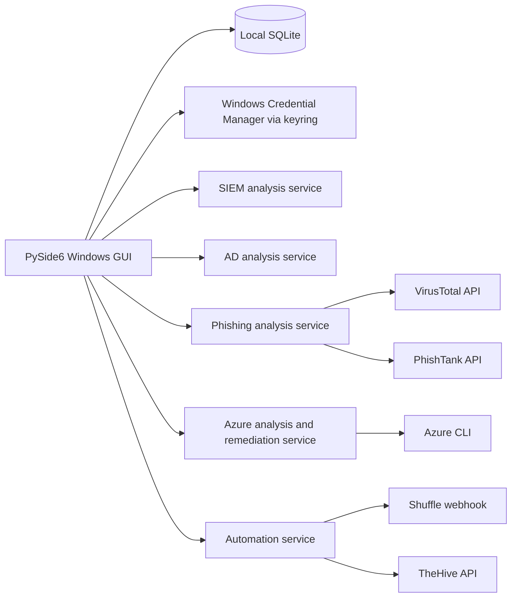

# Architecture

Detection and integration logic is separated from UI code so that it can be unit tested without a graphical session. Long-running network and remediation actions execute through Qt's thread pool to keep the interface responsive.
