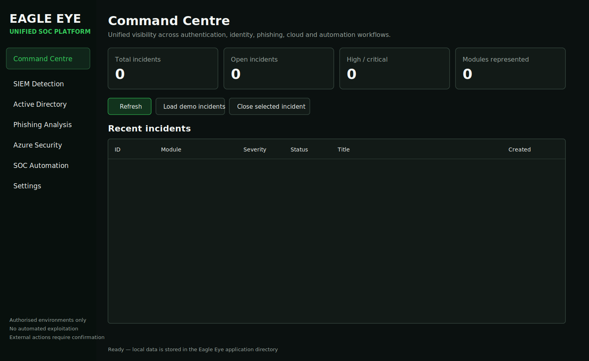
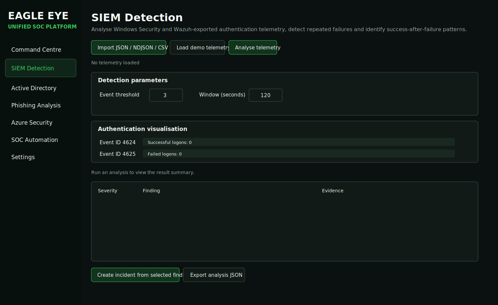

# Eagle Eye application visuals

These visuals are derived from the current PySide6 source code, including the 1500 × 920 main window, 245-pixel navigation sidebar, workspace names, dashboard cards, controls and telemetry workflow.

## Application interface

### Command Centre

### SIEM Detection

## UML diagrams

GitHub renders the following Mermaid source files when embedded in Markdown or opened in a Mermaid-compatible viewer:

- [`uml/system-architecture.mmd`](uml/system-architecture.mmd)
- [`uml/class-diagram.mmd`](uml/class-diagram.mmd)
- [`uml/incident-analysis-sequence.mmd`](uml/incident-analysis-sequence.mmd)

The screenshots show the source-defined empty initial state. Values and table rows change after demo data is loaded or telemetry is analysed.
